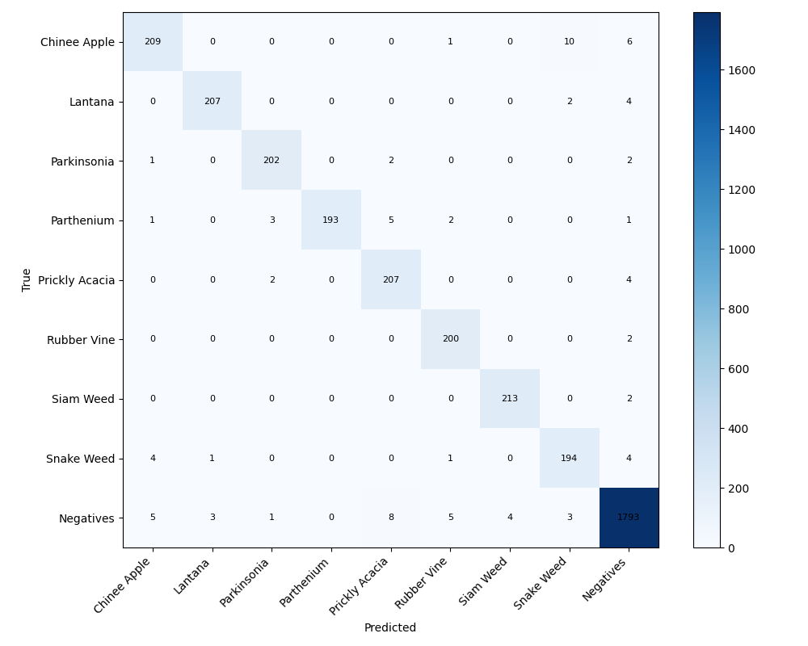
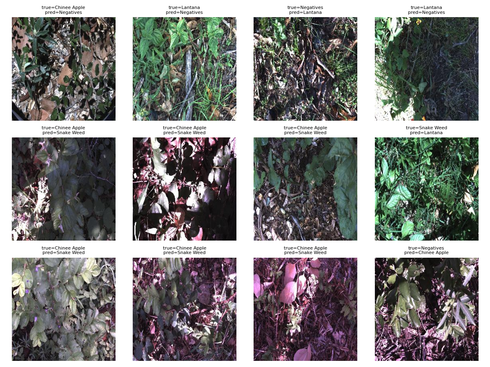

# Báo cáo Lab Day 2 — DeepWeeds

**Học viên:** Thái Phúc Tiến — 2A202602873. **Ngày:** 04/10/2026.

## 1. Kết quả và lựa chọn

Cấu hình được khóa bằng validation trước khi đọc test: ConvNeXt-Tiny, focal loss (T05), horizontal-flip TTA trung bình xác suất (I01). Ba seed 0, 1, 2 đạt test accuracy **97,78% ± 0,29 điểm phần trăm**, macro-F1 **0,9709 ± 0,0045**. Baseline cùng backbone, cross-entropy và một view đạt macro-F1 **0,9714 ± 0,0030**. Chênh lệch −0,00046 không cho thấy cải thiện; không đổi lựa chọn sau khi xem test.

Đây là lab so sánh backbone, recipe và inference. Không triển khai vòng active learning chọn mẫu–gán nhãn–huấn luyện lại trong thí nghiệm này.

## 2. Dữ liệu, kiểm tra pipeline và môi trường

Dùng toàn bộ 17.509 ảnh DeepWeeds, 9 lớp, fold 0 chính thức: train 10.501, validation 3.501, test 3.507. Không có Filename trùng giữa các tập. CSV và SHA-256 được lưu trong `data_labels/` và `split_checks.json`; không chia ngẫu nhiên lại. Negative chiếm 9.106 ảnh, khoảng 52%, nên macro-F1 là tiêu chí chính bên cạnh accuracy. CSV hiện có Chinee apple 1.126 và Lantana 1.063 ảnh, lệch một ảnh so với số mô tả 1.125/1.064; giữ nguyên dữ liệu chính thức.

Kiểm tra trên 9 ảnh thật (mỗi lớp một ảnh): loss ban đầu 2,17677, gần ln(9)=2,19722; overfit cùng vòng huấn luyện xuống 0,04775 sau 13 bước. Đây là kiểm tra pipeline, không phải kết quả tổng quát hóa. Có hình phân bố lớp, mẫu thật và augmentation.

Job chính chạy Tesla T4 trên Kaggle, Python 3.13.15, PyTorch 2.11.0+cu128, CUDA 12.8, timm 1.0.24. Bắt đầu 12:32:23, kết thúc 16:44:30 giờ Việt Nam ngày 04/10/2026 (4 giờ 12 phút 7 giây). Tổng 19 lần train × 10 epoch: 5 backbone, 8 recipe và 6 lần baseline/final; T00 seed 0 được chạy lại xác định. Có 18 bộ history riêng vì lần chạy T00 seed 0 cùng tên được thay thế. Log, cấu hình và history đều được lưu.

Recipe chung: input 224; train RandomResizedCrop và horizontal flip; validation/test resize 256, center crop 224, chuẩn hóa ImageNet. Batch 32, 10 epoch, AdamW backbone LR 1e-4, head LR 1e-3, weight decay 0,05; bias/norm không decay. Warmup 1 epoch rồi cosine; AMP khi train. Chọn checkpoint macro-F1 validation tốt nhất (giữ checkpoint đầu khi bằng điểm). Ablation dùng seed 0; baseline và final dùng seed 0/1/2. Test chỉ được dự đoán một lần cho mỗi cấu hình/seed sau khóa lựa chọn.

## 3. So sánh backbone

| ID | Backbone / pretrained tag | Params M | GMAC | Val macro-F1 | Train/epoch s |
| --- | --- | --- | --- | --- | --- |
| B01 | resnet50 / a1_in1k | 23.526 | 4.087 | 0.8173 | 58.8 |
| B02 | convnext_tiny / in12k_ft_in1k | 27.827 | 4.455 | 0.9639 | 83.9 |
| B03 | swin_tiny_patch4_window7_224 / ms_in1k | 27.526 | 4.490 | 0.9573 | 79.2 |
| B04 | efficientnet_b0 / ra_in1k | 4.019 | 0.385 | 0.8159 | 64.5 |
| B05 | mobilenetv3_large_100 / ra_in1k | 4.214 | 0.215 | 0.7135 | 62.0 |

ConvNeXt có macro-F1 cao nhất trong điều kiện này; Swin đứng kế tiếp. Số GMAC bao gồm attention, không chỉ Conv/Linear. Backbone nhỏ giảm tham số và FLOPs nhưng không đảm bảo latency thấp hơn trên T4. **Giới hạn so sánh:** ConvNeXt dùng pretrained ImageNet-12k rồi fine-tune ImageNet-1k; các model khác dùng tag ImageNet-1k. Vì vậy không quy toàn bộ chênh lệch cho kiến trúc. Mười epoch và recipe chung có thể chưa tối ưu cho từng backbone.

## 4. Ablation công thức huấn luyện

| ID | Thay đổi riêng so với T00 | Val macro-F1 | Delta |
| --- | --- | --- | --- |
| T00 | "{}" | 0.9639 | +0.0000 |
| T01 | "{\"init\": \"frozen\"}" | 0.8510 | -0.1129 |
| T02 | "{\"init\": \"scratch\"}" | 0.3600 | -0.6040 |
| T03 | "{\"aug\": \"color\"}" | 0.9697 | +0.0057 |
| T04 | "{\"mix\": \"cutmix\"}" | 0.9671 | +0.0031 |
| T05 | "{\"loss\": \"focal\"}" | 0.9697 | +0.0058 |
| T06 | "{\"loss\": \"ce_weighted\"}" | 0.9626 | -0.0014 |
| T07 | "{\"aug\": \"color\", \"loss\": \"focal\"}" | 0.9620 | -0.0020 |

Ba trục có nhiều mức: khởi tạo (pretrained fine-tune/frozen/scratch), augmentation (cơ bản/ColorJitter/CutMix), loss (CE/focal/weighted CE), thêm tổ hợp ColorJitter+focal. Mỗi hàng đổi yếu tố được ghi so với T00; T07 kiểm tra kết hợp.

Scratch giảm mạnh trong ngân sách 10 epoch. ColorJitter và focal đều tăng khoảng 0,0057 trên validation seed 0; T05 hơn T03 chỉ 0,000039, chưa đủ bằng chứng phân biệt ổn định. CutMix tăng ít hơn; weighted CE và tổ hợp không cải thiện. Kết quả cho thấy lợi ích không cộng tuyến tính. Lựa chọn T05 theo thứ hạng validation, không tuyên bố focal luôn tốt hơn CE.

## 5. Suy luận, hiệu chuẩn và độ trễ

| ID | Phương pháp | Val macro-F1 | ECE | p50 / p95 / p99 ms |
| --- | --- | --- | --- | --- |
| I00 | 1-view FP32 | 0.9697 | 0.0415 | 5.417 / 5.737 / 6.294 |
| I01 | Horizontal-flip TTA, mean probabilities | 0.9715 | 0.0423 | 10.782 / 12.161 / 13.187 |
| I03 | Horizontal-flip TTA, mean logits | 0.9710 | 0.0408 | 10.907 / 13.523 / 18.916 |
| I07 | Temperature scaling | 0.9697 | 0.0097 | 5.472 / 5.954 / 6.144 |
| I08 | Conv-BN fusion (no-op) | 0.9697 | 0.0415 | 5.495 / 5.927 / 6.031 |
| I09 | AMP FP16 (validation-only diagnostic) | 0.9694 | 0.0406 | 7.391 / 7.698 / 8.243 |

I01 và I03 cùng hai view nhưng khác không gian tổng hợp; I01 có validation macro-F1 cao nhất. I07 fit temperature T=0,689924 trên validation, giảm ECE một view từ 0,04153 xuống 0,00971, giữ nguyên argmax/F1. Đây là chẩn đoán validation, không áp dụng TS vào final I01 và không khẳng định hiệu chuẩn test.

I08 là **no-op**: ConvNeXt-Tiny không có BatchNorm để gộp, nên không tính là phương pháp inference bổ sung có ý nghĩa. I09 là AMP FP16 thực sự, chạy toàn bộ validation trong job phụ sau khóa lựa chọn; không train thêm, không đọc hoặc đánh giá lại test, không thay đổi final. Bốn phương pháp bổ sung có ý nghĩa là I01, I03, I07, I09.

Đo với 10 warmup, 100 iteration, CUDA synchronize, batch 1 và batch 32; TTA đo cả tạo view, forward và tổng hợp. I01 p95=12,161 ms, khoảng hai lần chi phí một view. AMP batch 32 đạt p50=46,768 ms, 684,23 ảnh/s; batch 1 không nhanh hơn FP32 trong đo này. I09 thuộc session T4 khác nên chênh lệch có thể chịu tác động clock/runtime. I07 latency chỉ đo forward, chưa cộng TS/softmax. Các phép đo loại trừ đọc ảnh, CPU preprocessing, truyền dữ liệu và chu kỳ robot; đạt ngân sách model 100 ms không chứng minh robot thời gian thực end-to-end. Latency final đại diện checkpoint T05 seed 0, không đo riêng cả ba seed.

## 6. Final qua ba seed

| Cấu hình | Test accuracy | Test macro-F1 | Test ECE | Val macro-F1 |
|---|---|---|---|---|
| T00 + I00 | 97,73% ± 0,26 pp | 0,9714 ± 0,0030 | 0,0092 ± 0,0029 | 0,9650 ± 0,0034 |
| F01: T05 + I01 | 97,78% ± 0,29 pp | 0,9709 ± 0,0045 | 0,0383 ± 0,0046 | 0,9703 ± 0,0011 |

Std là sample std (ddof=1), không phải khoảng tin cậy. Accuracy tăng khoảng 0,05 điểm phần trăm nhưng macro-F1 không tăng; cả hai chênh lệch nhỏ so với biến thiên seed. ECE final kém hơn baseline. Chênh macro-F1 val/test final chỉ 0,00061, dưới ngưỡng 0,02. Báo cáo giữ nguyên các kết quả này, không chọn lại bằng test.

Tự chấm bằng `eval.py grade`: I1=7, I2=0, I3=4, I4b=1, I5=2; **14/19 điểm có đủ dữ liệu**, phần I tối đa 20. I4a chưa chấm vì không có cặp final calibrated/uncalibrated test. Đây là gợi ý từ evaluator, giảng viên xác nhận; không suy ra điểm tổng 100.

## 7. Theo lớp và phân tích lỗi

| Lớp | Precision mean ± std | Recall mean ± std | F1 mean ± std |
| --- | --- | --- | --- |
| Chinee apple | 0.9666 ± 0.0158 | 0.9351 ± 0.0092 | 0.9506 ± 0.0117 |
| Lantana | 0.9692 ± 0.0111 | 0.9812 ± 0.0081 | 0.9751 ± 0.0025 |
| Parkinsonia | 0.9775 ± 0.0072 | 0.9791 ± 0.0056 | 0.9783 ± 0.0041 |
| Parthenium | 1.0000 ± 0.0000 | 0.9561 ± 0.0129 | 0.9775 ± 0.0068 |
| Prickly acacia | 0.9302 ± 0.0020 | 0.9797 ± 0.0072 | 0.9543 ± 0.0025 |
| Rubber vine | 0.9757 ± 0.0170 | 0.9835 ± 0.0076 | 0.9795 ± 0.0054 |
| Siam weed | 0.9786 ± 0.0026 | 0.9922 ± 0.0027 | 0.9854 ± 0.0013 |
| Snake weed | 0.9381 ± 0.0098 | 0.9657 ± 0.0147 | 0.9517 ± 0.0122 |
| Negative | 0.9884 ± 0.0019 | 0.9837 ± 0.0022 | 0.9861 ± 0.0014 |

Recall Chinee apple 93,51%, Snake weed 96,57%. F1 hai lớp này khoảng 0,951, thấp hơn nhiều lớp còn lại. Confusion matrix seed 0 có Chinee apple→Snake weed 10 ảnh (chiều ngược 4), Negative→Prickly acacia 8, Chinee apple→Negative 6; còn Parthenium→Prickly acacia 5. Các hình lỗi giúp xem ảnh thật, nhưng 12 ảnh được lấy theo thứ tự Filename, không phải mẫu đại diện thống kê và không đủ chứng minh nguyên nhân sinh học.

## 8. Kết luận và hướng tiếp theo

Trong ngân sách này, pretrained ConvNeXt là lựa chọn tốt trên validation; recipe và TTA có tác động đo được trên một seed nhưng lợi ích không được xác nhận trên test ba seed. Nếu ưu tiên chi phí và độ tin cậy xác suất, baseline CE một view là ứng viên hợp lý cho một thí nghiệm tiếp theo. Cần nghiên cứu với nhiều seed ở vòng chọn recipe và hiệu chuẩn trên tập calibration riêng; không sửa kết quả hoặc tái tối ưu trên test đã dùng. Chưa đo triển khai thực tế, phân bố ngoài miền hoặc active learning.

## 9. Bằng chứng và tái lập

`results.xlsx` gồm Summary, Final, Backbones, Training, Inference, PerClass, Latency; Final dùng AVERAGE/STDEV.S từ hàng seed. `tables.json` là bảng hợp nhất; `evidence/tables_raw_gpu.json` giữ bảng gốc trước bổ sung AMP/no-op annotations. CSV bảng được đồng bộ với JSON. 24 CSV validation và 6 CSV test được đối chiếu Filename/Label với fold 0; metric recompute khớp bảng. `eval.py` giữ nguyên bản repo.

Xem `README.md` để mở hai notebook Kaggle, tái chạy và đánh giá. Checkpoint giữ trong private Kaggle Output, không đưa ảnh gốc hoặc weights vào ZIP. Log job phụ và `amp_validation.json` giải thích I09; không dùng kết quả bổ sung để sửa lựa chọn đã khóa.
